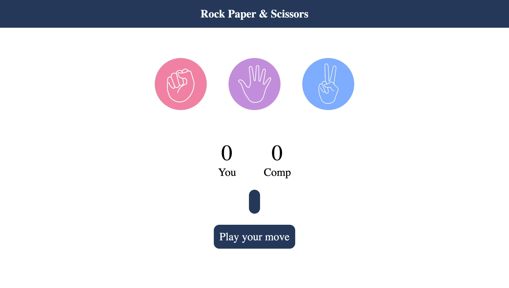
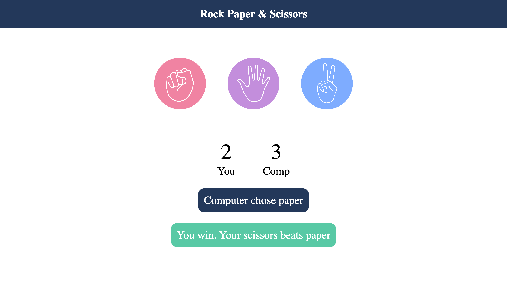
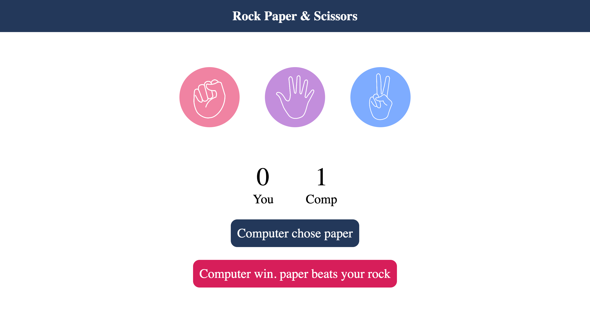
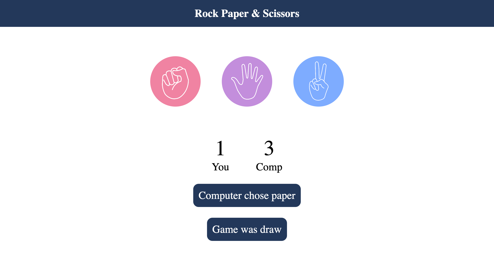

# Rock Paper &amp; Scissors
Rock Paper &amp; Scissors
- An interactive browser-based game of Rock, Paper, Scissors, enhancing user engagement with an intuitive design and responsive gameplay.
  
- Implemented real-time score tracking and dynamic feedback using DOM manipulation, creating a seamless user experience.

- Engineered a scalable event-driven architecture to handle player inputs and AI-generated moves, ensuring accurate game logic and performance.

What the project looks like
Initial game

Player wins

Computer wins

When the game ties

